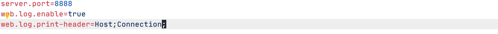

### A custom spring boot starter project.

​    Mainly provides interface for requesting log information printing function, which simplifies the need to write an interface requesting log function for each project.

[中文注释](./README_CN.md) 


### How to use

1. **git clone https://github.com/727474430/web-logging-spring-boot-starter.git**

2. **cd web-logging-spring-boot-starter**

3. **mvn install      # This will install the project to your local repository**

4. **Introducing dependencies in spring boot project that need to be used**

   ```xml
   <dependency>
       <groupId>com.raindrop</groupId>
       <artifactId>web-logging-spring-boot-starter</artifactId>
       <version>1.0-SNAPSHOT</version>
   </dependency>
   ```

5. **Add following attributes in application.properties/application.yml**

   * web.log.enable=true

     Whether to open the log printing function. default is **"false"** not open. select true is open

   * web.log.exclude-path=/oldapp/;/oldproject/

     Need to exclude the path, Use **";"** split multiple paths

   * web.log.print-header

     Need to printing request header, User **";"** split multiple headers


### Example

* application.properties

  ```xml
  web.log.enable=true
  web.log.excludePath=/oldapp/;/oldproject/
  web.log.printHeader=Host;Cookie
  ```

* application.yml

  ```yaml
  web:
    log:
      enable: true
      exclude-path: /oldapp/;/oldproject/
      print-header: Host;Cookie # notes: Case Sensitive
  ```


### Screenshots




[](https://jitpack.io/#727474430/web-logging-spring-boot-starter)