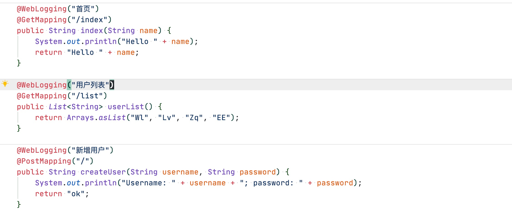

### 一个自定义 spring boot starter 项目

​  主要提供了接口请求日志信息打印的功能，简化了为每个项目编写接口请求日志功能的需要。


### 如何使用.

1. **git clone <https://github.com/727474430/web-logging-spring-boot-starter.git>** 

2. **cd web-logging-spring-boot-starter** 

3. **mvn install** 

4. **在需要使用的 SpringBoot 项目中引入依赖关系**

   ```xml
   <dependency>
       <groupId>com.raindrop</groupId>
       <artifactId>web-logging-spring-boot-starter</artifactId>
       <version>1.1.RELEASE</version>
   </dependency>
   ```

   

5. 在**application.properties/application.yml**文件中添加下列属性

   * web.log.enable=true 

     是否开启日志打印功能，默认为 **"false"** 不开启，选择 **true** 开启。

   * web.log.exclude-path=/disable;/nomapping

     需要排除的请求路径，使用 **";"** 分割多个请求路径

   * web.log.print-header 

     需要打印的请求头，使用 **";"** 分割多个请求

   

### 示例.

* application.properties

  ```properties
  web.log.enable=true
  web.log.print-header=Host;Connection;
  web.log.exclude-path=/disable
  ```

* application.yml

  ```yaml
  web:
    log:
      enable: true
      exclude-path: /disable
      print-header: Host;Connection;
  ```


### 截图





[](https://jitpack.io/#727474430/web-logging-spring-boot-starter)
